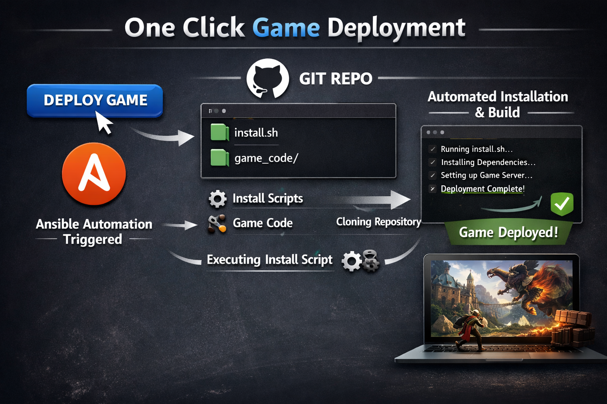
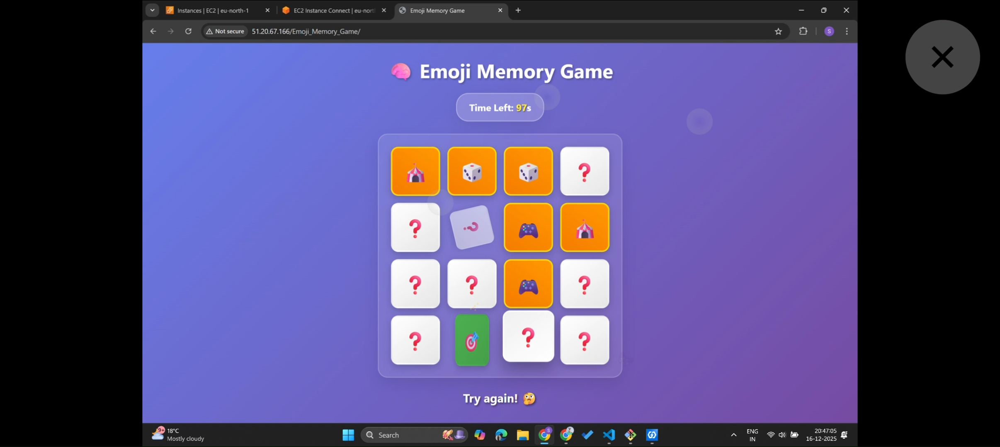
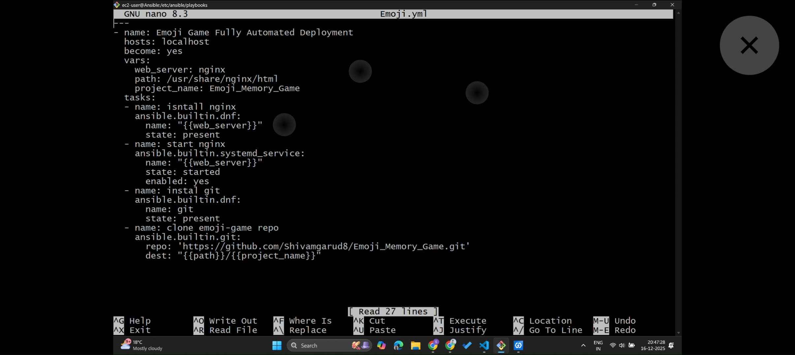
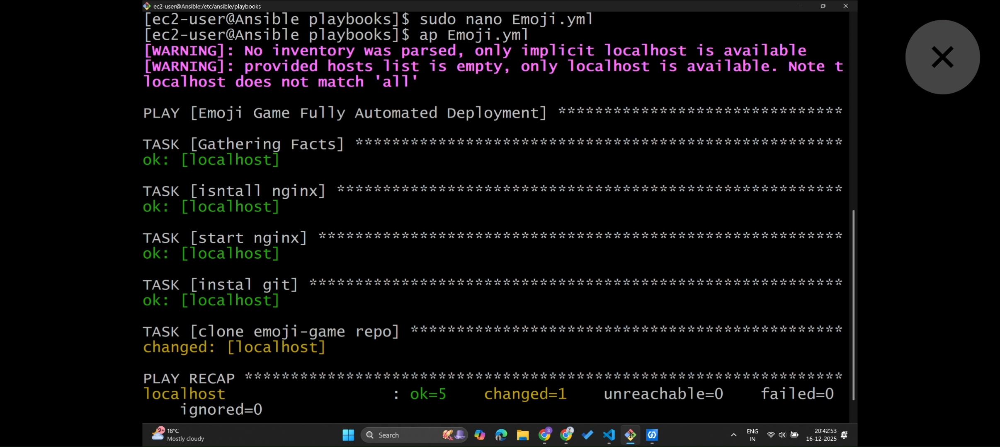
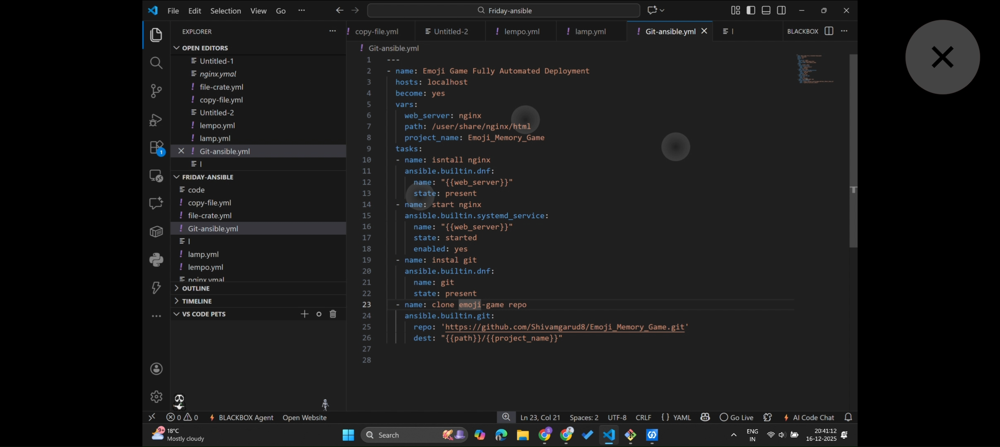

# 🎮 Emoji Game Automation with Ansible


---

## 🚀 Project Overview

The **Emoji Game** is a fun, interactive game that challenges users to guess or match emojis based on certain rules.  
This project automates the deployment of the Emoji Game application on any Linux machine using **Ansible**, making setup fast, easy, and repeatable.

With this automation, you don’t need to manually install dependencies or configure the environment—Ansible handles everything for you.  

---

## 🛠️ Features

- ✅ Fully automated deployment using **Ansible**
- ✅ Installs all dependencies required for the Emoji Game
- ✅ Starts the game automatically after setup
- ✅ Works on **Linux** machines
- ✅ Modular tasks for easy customization
- 🎨 Attractive console output for gameplay

---


---

## ⚡ Technologies Used

- **Ansible** – Automation tool for deployment

- **Amazon Linux** – Target deployment OS
- **NGINX** – Optional web interface for the game
- **Git** – Clone the repository

---

## 📝 Installation & Setup

1. **Copy all code from this repo**

```bash
git clone https://github.com/Shivamgarud8/Emoji_Memory_Game-Ansible.git

```
2. **Make Emoji.yml file**

3. **check the Systax error of Emoji.yml file**
 
 ```bash
ansible-playbook --syntax-check
```

 4. **run the file**
 ```
 ansible-playbook emoji.yml

```


## Screenshots






---
👩‍🏫 **Guided and Supported by [Trupti Mane Ma’am](https://github.com/iamtruptimane)**  
---

👨‍💻 **Developed By:**  
**Krinjal Matekar**  
🧠 *DevOps & Cloud Enthusiast*  
💼 *Automating deployments, one pipeline at a time!*  
🌐 [GitHub Profile](https://github.com/iamkrinjal)
🌐 [Linkedin](www.linkedin.com/in/krinjal-matekar)


